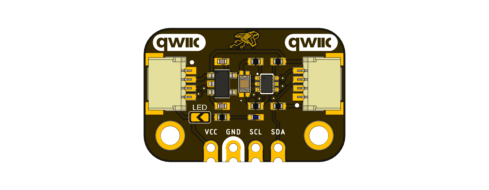

# DevLab: I2C VEML3328 Color Sensor

## Introduction

This module features the VEML3328,which is a compact 16-bit RGBCIR Color Sensor module incorporating photodiodes, amplifiers, analog/digital circuits into a single CMOS chip. It provides accurate measurement of red, green, blue, clear, and IR light, making it well suited for industrial and consumer applications.

  
  
<em>Development Board</em>

### Quick Setup

## Overview

| Feature           | Description                                         |
|-------------------|-----------------------------------------------------|
| Microcontroller   | 8-bit MCU                                           |
| Memory            | Flash, SRAM, EEPROM                                 |
| Clock Speed       | 16 MHz                                              |
| Power Supply      | USB-C (5V)                                          |
| Interfaces        | UART, I2C, SPI, PWM, ADC, GPIO                      |
| LED Matrix        | 5x5 RGB LED Matrix                                  |
| Connectivity      | USB-C for programming and power                     |
| Form Factor       | UNO-compatible                                      |
| Development IDEs  | Arduino IDE, PlatformIO                             |
| Onboard Features  | Integrated LED matrix, programmable LED, reset button|
| Expansion Port    | I2C connector for sensors and modules               |

## Applications

- **Prototyping:** Quickly develop and test ideas.
- **Education:** Suitable for learning microcontroller basics.
- **Wearables:** Compact and versatile for wearable devices.
- **Displays:** Use the LED matrix for simple visual output.

## Resources

- [Schematic Diagram](./hardware/unit_sch_v_1_0_0_ue0128_i2c_veml3328_sensor_light.pdf)
- [Pinout Diagram](./hardware/unit_pinout_v_1_0_0_ue0128_veml3328_light_sensor_en.pdf)
- [Getting Started Guide](#)

## 📝 License

All hardware and documentation in this project are licensed under the **MIT License**.  
See [`LICENSE.md`](LICENSE.md) for details.

  Template created by UNIT Electronics

