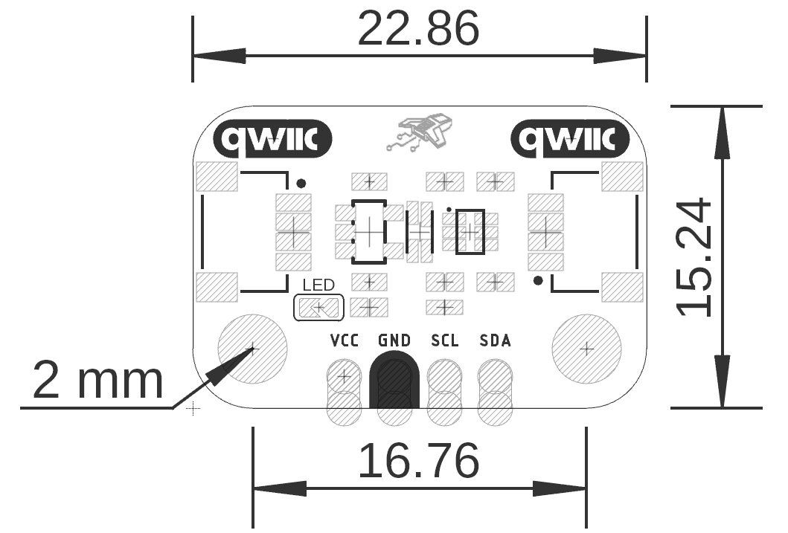

# Hardware

<a href="unit_sch_v_1_0_0_ue0128_i2c_veml3328_sensor_light.pdf"> Schematic</a>

## Pinout

    <a href="unit_pinout_v_1_0_0_ue0128_veml3328_light_sensor_en.pdf"> Pinout</a>
     
     
     
    

| Pin Label | Function    | Notes                             |
|-----------|-------------|-----------------------------------|
| VCC       | Power Supply| 3.3V or 5V                       |
| GND       | Ground      | Common ground for all components  |

## Dimensions

<a href="./resources/unit_dimensions_v_1_0_0_ue0128_veml3328_light_sensor.png">  Dimensions</a>

## Topology

<a href="./resources/unit_topology_v_1_0_0_ue0128_veml3328_sensor_luz_en.png">  Topology</a>
 
 
 

| Ref. | Description                              |
|------|------------------------------------------|
| U1   | VEML3328 RGBIR Color Sensor              |
| U2   | AP2112K 3.3 V Low Dropout (LDO) Voltage Regulator  |
| Q1   | BSS138AKDW Dual Bidirectional I²C Level Shifter    | 
| LED (D1)  | Power On LED (Red)                  |
| J1, J3   | QWIIC Connector (JST 1 mm pitch) for I2C |
| J2   | 2.54 mm Castellated Pin Header           |

## Pin & Connector Layout
| Pin   | Voltage Level | Function                                                  |
|-------|---------------|-----------------------------------------------------------|
| VCC   | 3.3 V – 5.5 V | Provides power to the on-board regulator and sensor core. |
| GND   | 0 V           | Common reference for power and signals.                   |
| SDA   | 1.8 V to VCC  | Serial data line for I²C communications.                  |
| SCL   | 1.8 V to VCC  | Serial clock line for I²C communications.                 |

> **Note:** The module also includes a Qwiic/STEMMA QT connector carrying the same four signals (VCC, GND, SDA, SCL) for effortless daisy-chaining.

## Functional Description

The UNIT I²C VEML3328 Color Sensor is a high-performance RGBIR (Red, Green, Blue, Clear, and Infrared) light-to-digital converter designed for color sensing, ambient light measurement, and spectral analysis applications. The module integrates the VEML3328 color sensor together with an onboard 3.3 V voltage regulator and a bidirectional I²C level shifter, allowing direct interfacing with both 3.3 V and 5 V host systems.

The sensor converts incident light into independent 16-bit digital measurements for the Red, Green, Blue, Clear, and Infrared channels, eliminating the need for external analog signal conditioning. Communication is performed through a standard I²C interface, accessible from either of the onboard QWIIC connectors or the 2.54 mm castellated header, enabling seamless integration into embedded systems and rapid prototyping platforms.

### I²C Communication Interface

The module operates as an I²C slave device using the fixed 7-bit address 0x10 for configuration and data acquisition. All communication is fully bidirectional through the standard I²C protocol.

Device communication can be verified by reading the Device ID Register (0x0C). The lower byte of this register returns 0x28, confirming that the sensor is correctly connected and responding on the I²C bus.

The module may be connected using either of the two onboard QWIIC (JST-SH 1.0 mm) connectors or through the 2.54 mm castellated header, providing flexibility for breadboard prototyping and PCB integration.

## Applications

- White balancing and color cast correction in digital cameras
- Automatic LCD backlight adjustment
- On/Off Light Switching in industrial and consumer applications
- Monitoring of LED Color output for IoT and smart Lighting’

# References

- [Datasheet VEML3328](https://cdn.sparkfun.com/assets/f/c/d/c/5/VEML3328_datasheet.pdf)
