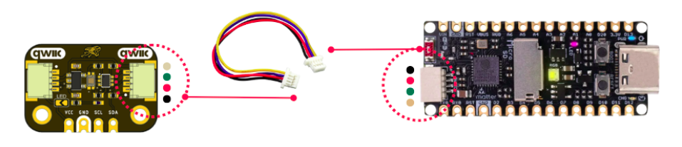

# Getting Started

This section demonstrates how to use the DevLab VEML3328 RGB-IR Color Sensor with the DevLab Pulsar C6 using the Arduino framework.

After completing this guide, you will be able to:

- Install the DevLab VEML3328 library.
- Connect the sensor using the I²C interface.
- Read the Red, Green, Blue, IR, and Clear channels.
- Display the sensor measurements in the Serial Monitor.

## Requirements

### Hardware
- DevLab Pulsar C6
- DevLab VEML3328 RGB-IR Color Sensor
- USB Type-C cable

### Software
- Arduino IDE
- DevLab VEML3328 Library

### Wiring
The sensor communicates using the I²C bus.

| **VEML3328** | **Pulsar C6** |
|--------------|---------------|
| VCC          | 3.3 V         |
| GND          | GND           |
| SDA          | GPIO 6        |
| SCL          | GPIO 7        |

  
  
<em>Wiring</em>

# Install the Library

- Open Arduino IDE.
- Open Library Manager.
- Search for DevLab VEML3328.
- Install the latest version.

